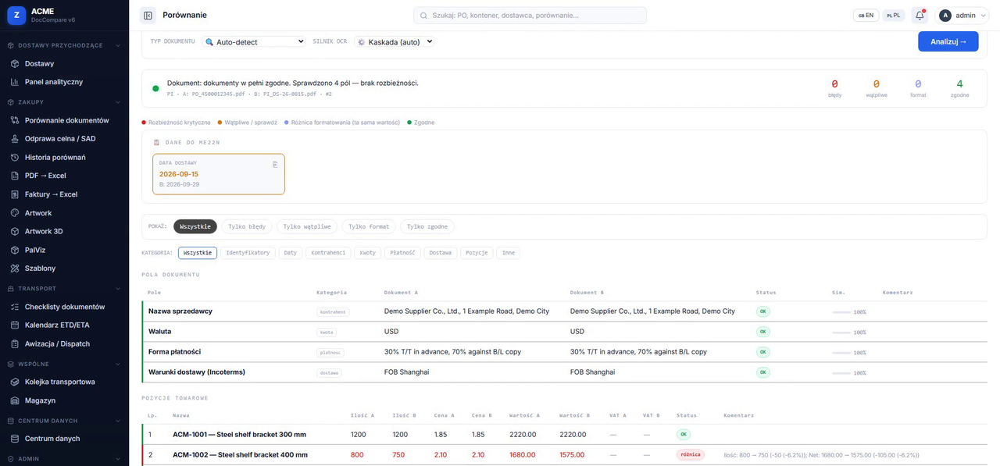

# DocCompare v6

[](https://github.com/TomaszWu14/doccompare/actions/workflows/ci.yml)



**Compares international trade documents (PO, invoices, packing lists, customs declarations) line by line for purchasing and logistics teams, and flags price, quantity and Incoterms mismatches before they reach customs or settlement.**

> **Portfolio project.** Company names are replaced with fictional ones; demo and test data are synthetic.
>
> Source shared for review (portfolio), all rights reserved — see [`LICENSE`](LICENSE).

A Flask web application for ACME that intelligently compares
international trade documents (Purchase Orders, Proforma/Commercial Invoices, Packing Lists,
Customs Declarations / SAD, B/L, WZ, FV) and artwork/packaging PDFs, and manages the end-to-end
purchasing → transport → customs → settlement workflow.

Originally deployed with Docker on **Coolify / Hetzner**; this portfolio copy ships no deploy workflow.

## At a glance

| | |
|---|---|
| **Problem** | Purchasing and logistics teams cross-checked PO ↔ Proforma ↔ Commercial Invoice ↔ Packing List ↔ SAD by hand — price, quantity and Incoterms mismatches surfaced only at customs or settlement. |
| **Solution** | PDF/table extraction with per-supplier column profiles, line-level comparison with tolerances, customs (SAD) checks, artwork validation (EAN/GS1), and a purchasing → transport → customs → settlement workflow. |
| **Stack** | Python, Flask, pdfplumber / PyMuPDF / camelot, RapidOCR + Tesseract, optional LLM validation (Anthropic API), PostgreSQL/SQLite, RQ/Redis jobs, gunicorn, Docker. |
| **Quality** | ~600 tests (`pytest tests/`), CI on GitHub Actions, scheduled security scans. |

## Quick start (light)

The full `requirements.txt` pulls in the ML/OCR stack (PyTorch, DocTR, …) — several GB.
To run the tests and the core comparison logic, the same light set as CI is enough:

```bash
python -m venv .venv && source .venv/bin/activate   # Windows: .venv\Scripts\activate
pip install pytest python-dateutil dateparser babel flask werkzeug pydantic pypdf \
            reportlab pdfplumber rapidfuzz numpy "pandas>=2.0"
python -m pytest tests/ -q        # ~600 tests, tests needing heavy deps are skipped
python app.py                     # http://localhost:5000 (OCR/ML/artwork features need the full stack)
```

## My contribution

- **Design and implementation of the whole application** — I am the sole author: process analysis with purchasing/logistics, data model, extraction cascade, comparison engine, UI, tests and deployment.
- **Extraction and comparison engine** — PDF/table extraction cascade (PyMuPDF → Camelot → pdfplumber → OCR) with per-supplier column profiles, and line-level matching with tolerances.
- **Scale:** ~600 tests (`pytest tests/`), ~410 Flask routes covering purchasing → transport → customs → settlement.
- **Beyond comparison:** customs (SAD) checks, artwork validation (EAN/GS1), invoice → Excel extraction, optional LLM validation via the Anthropic API.

## Why this stack

Flask keeps a document-heavy internal tool simple: server-rendered pages, blueprints for modules and no separate front-end build. PDF work relies on mature Python libraries (PyMuPDF, pdfplumber, Camelot) chained as a fallback cascade, with OCR (RapidOCR, Tesseract) only for scans, because no single extractor handles every supplier's layout. LLM validation is optional and runs behind deterministic rules, so the app still works without an API key. SQLite for local work and PostgreSQL in production, with RQ/Redis moving heavy jobs off the web process.

## Limitations and next steps

- **`app.py` is still a large module** (~20k lines); [`docs/PLAN_REFAKTORU.md`](docs/PLAN_REFAKTORU.md) describes the move to blueprints without changing the framework.
- **Heavy ML dependencies** — PyTorch costs roughly 2 GB RAM per worker; CI only covers the light, pure-logic part, ML/OCR paths are not exercised there.
- **In-process state** — parts of the state live in module memory, which is risky with multiple workers (see [`AUDIT_2026-06-08.md`](AUDIT_2026-06-08.md)).
- **Open audit items** — [`AUDIT_2026-06-08.md`](AUDIT_2026-06-08.md) lists findings by severity plus 100 improvement questions to work through.
- **No deploy workflow** in this portfolio copy — the original ran on Docker / Coolify / Hetzner.

## Where to start reading

- [`enhanced_comparator.py`](enhanced_comparator.py) — table parsing into line items and the line-level comparison with tolerances.
- [`pdf_extractor.py`](pdf_extractor.py) — the text/table extraction cascade with fallbacks.
- [`invoice_pipeline.py`](invoice_pipeline.py) — one invoice end to end: supplier profile gate → extraction → mapping → saved items.

Commit history was squashed while preparing the portfolio version (anonymisation).

## Video

Coming soon (YouTube).

## Common Commands

```bash
# Install dependencies (full stack incl. ML/OCR — large)
pip install -r requirements.txt
# Production subset
pip install -r requirements-prod.txt
# Dev tooling only (pytest, ruff)
pip install -r dev-requirements.txt

# Run the development server (http://localhost:5000, debug on)
python app.py

# Run with gunicorn (production-like)
gunicorn app:app -c gunicorn.conf.py

# Apply database migrations (idempotent — safe to re-run)
python migrate_db.py

# Run the test suite
python -m pytest tests/ -q
```

## Documentation

- [`CLAUDE.md`](./CLAUDE.md) — architecture overview, conventions, and environment variables.
- [`docs/DOKUMENTACJA_IT.md`](./docs/DOKUMENTACJA_IT.md) — IT runbook (Polish), hosting and
  operations summary.
- [`docs/BACKUP_RESTORE.md`](./docs/BACKUP_RESTORE.md) — database and data backup/restore
  procedure.
