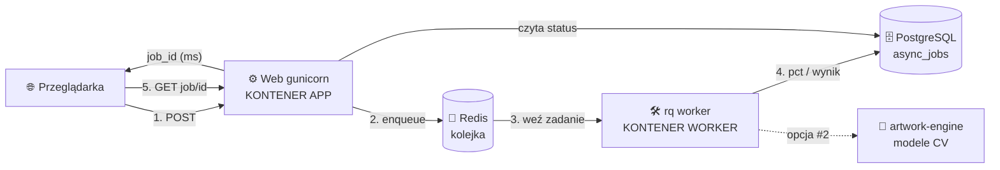
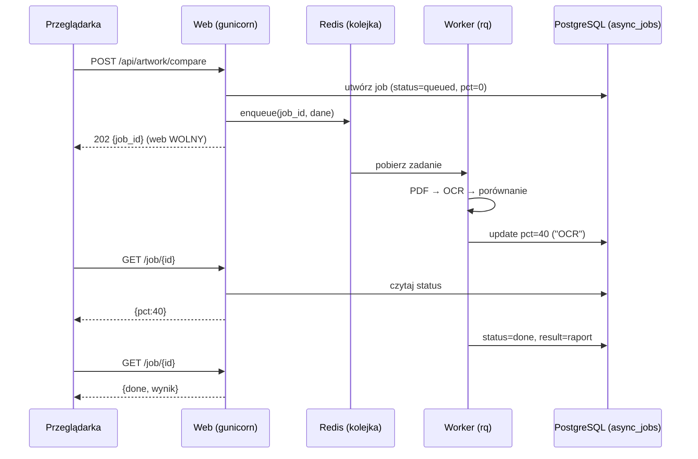

# Kolejkowanie zadań (RQ + Redis) — szczegółowa mapa procesu

> Cel dokumentu: wyjaśnić **jak działa kolejkowanie** w kontekście DocCompare, krok po kroku,
> z diagramami, scenariuszami brzegowymi i planem wdrożenia. **Nic w kodzie nie jest jeszcze zmieniane.**
> Rysunek techniczny: `docs/kolejkowanie_diagram.svg`.

---

## 1. Po co to (problem → rozwiązanie)
**Dziś:** ciężkie operacje (ekstrakcja PDF, OCR, porównania dokumentów i artworków) liczą się **w procesie web** (gunicorn, wątki) — blokują workera obsługującego strony, grożą timeoutem 300 s i **giną przy deployu**. Współbieżność dławi semafor `_HEAVY_SEM` (obejście).

**Po zmianie:** web tylko **wrzuca zadanie do kolejki** i zwraca `job_id`; ciężką pracę robi **osobny proces (worker)**; postęp i wynik lądują w istniejącej tabeli **`async_jobs`** (UI postępu bez zmian).

---

## 2. Komponenty
| Komponent | Rola | Nowy? |
|---|---|---|
| **Web (gunicorn)** | przyjmuje żądanie, tworzy job, `enqueue`, zwraca `job_id` | istnieje |
| **Redis** | kolejka „do zrobienia" + kolejka „failed" | **nowy** (zasób w Coolify) |
| **Worker (`rq worker`)** | pobiera zadania, liczy, zapisuje postęp/wynik | **nowy proces** (ten sam obraz) |
| **PostgreSQL `async_jobs`** | „tablica postępu" (status/pct/result/error) | istnieje |
| **Przeglądarka** | odpytuje `GET /…/job/<id>` o postęp | istnieje |

---

## 3. Architektura (diagram)

## 4. Przebieg w czasie (sekwencja)

---

## 5. Współbieżność — jak kolejka szereguje użytkowników
Przykład: **5 osób** klika „Porównaj" niemal naraz, **2 workery**:

| Czas | Worker A | Worker B | Kolejka (czeka) |
|---|---|---|---|
| t0 | zad. 1 | zad. 2 | 3, 4, 5 |
| t1 (zad.1 koniec) | zad. 3 | zad. 2 | 4, 5 |
| t2 (zad.2 koniec) | zad. 3 | zad. 4 | 5 |
| t3 | zad. 5 | — | — |

- Nikt nie dostaje błędu/timeoutu — **czeka w kolejce** z widocznym statusem „queued".
- Chcesz krótsze oczekiwanie → **dokładasz worker** (lub mocniejszą maszynę pod workery).
- To zastępuje ręczny `_HEAVY_SEM`.

---

## 6. Scenariusze brzegowe (to jest sedno korzyści)
| Sytuacja | Dziś (wątki w web) | Z kolejką |
|---|---|---|
| **Deploy APP w trakcie liczenia** | zadanie ginie | **czeka w Redis**, worker dokończy/ponowi |
| **Błąd w zadaniu** | często „znika" w wątku | ląduje w kolejce **„failed"** z opisem; można ponowić |
| **Operacja > 300 s** | timeout na web | brak timeoutu web; **limit per zadanie** w workerze |
| **Przeciążenie (dużo zadań)** | ryzyko OOM/zwisu | nadmiar **stoi w kolejce**, serwer stabilny |
| **Restart Redis** | n/d | zadania przetrwają, jeśli włączysz trwałość Redis (AOF/RDB); inaczej trzeba ponowić |

---

## 7. Na co uważać (projektowo)
1. **Argumenty zadania = lekkie** (ścieżki/identyfikatory, nie wielkie obiekty w pamięci). U Was pliki są na dysku/w bazie → pasuje.
2. **Worker a PyTorch:** jeśli worker importuje `artwork_comparator`, to **worker** ładuje ~2 GB modeli. Dlatego #1 najlepiej łączyć z **#2** (worker woła lekki serwis ML).
3. **Idempotencja:** zadanie ma się bezpiecznie powtórzyć (nadpisuje wynik, nie dubluje).
4. **Sprzątanie:** `async_jobs` czyszczone po pobraniu (już robicie) + TTL na wyniki w Redis.
5. **Monitoring:** `rq-dashboard` (podgląd queued/started/failed).

---

## 8. Plan wdrożenia (gdy padnie „działamy")
**Faza 1 — szkielet (PoC, 1 endpoint):**
1. Redis w Coolify + `rq` w `requirements.txt`.
2. `jobs.py`: `compare_artwork_job(...)` woła **istniejącą** logikę i aktualizuje `async_jobs`.
3. Endpoint `/api/artwork/compare`: zamiast liczyć → `queue.enqueue(...)` + zwróć `job_id`.
4. Drugi proces: `rq worker` (osobny serwis w Coolify, ten sam obraz, komenda `rq worker`).
5. Test: 3–5 porównań naraz + deploy w trakcie → web nie „mruga", zadania kończą się.

**Faza 2 — migracja reszty:** kolejne ciężkie endpointy (porównania dokumentów, ekstrakcja PDF) przepinane **po kolei**; usunięcie `_HEAVY_SEM`.

**Faza 3 — operacje:** trwałość Redis (decyzja), `rq-dashboard`, alert na kolejkę „failed".

**Wycofanie:** każdy endpoint można odwrócić do trybu „licz teraz" niezależnie (zmiana jest lokalna). Brak „wielkiego wybuchu".

---

## 9. Czego NIE zmienia
- **Funkcjonalność** dla użytkownika — identyczna (ten sam wynik porównania, ten sam pasek postępu).
- **Baza i logika biznesowa** — bez zmian; kolejka dotyczy tylko *wykonania* ciężkich zadań.
- **Framework** — zostaje Flask. To nie jest przepisywanie aplikacji.

---

## 10. Faza 1 — ZAIMPLEMENTOWANE (PoC: 1 endpoint)

Wdrożony szkielet kolejki z **bezpiecznym fallbackiem** — bez `REDIS_URL` aplikacja
działa dokładnie jak dotąd (wątki w procesie web), więc zmiana jest w 100% odwracalna.

### Co doszło w kodzie
| Plik | Rola |
|---|---|
| `jobs.py` | Abstrakcja kolejki: `enqueue(func, *args)` → RQ (gdy `REDIS_URL`) **albo** wątek-daemon (fallback). Brak twardej zależności od Redis (leniwy import). |
| `worker.py` | Proces workera: `python worker.py` (albo `rq worker -u $REDIS_URL doccompare`). Importuje `app`, więc ma całą logikę i modele. |
| `app.py` (batch artworków) | Spawn wątku zamieniony na `jobs.enqueue(_artwork_batch_worker, …)`. Kontrakt `artwork_batch_jobs`/status bez zmian. |
| `requirements*.txt` | Dodane `rq`, `redis` (wymagane tylko gdy włączasz Redis). |
| `.env.example` | `REDIS_URL`, `RQ_QUEUE`, `RQ_JOB_TIMEOUT`. |
| `tests/test_jobs_queue.py` | Testy ścieżki fallback (bez Redis). |

### Jak włączyć (Coolify)
1. **Redis** — dodaj zasób Redis w Coolify; skopiuj URL (np. `redis://redis:6379/0`).
2. **Web** — ustaw env `REDIS_URL` (+ opcjonalnie `RQ_QUEUE`, `RQ_JOB_TIMEOUT`). Od teraz web tylko `enqueue`.
3. **Worker** — dodaj **drugi serwis** z **tego samego obrazu**, z **tym samym env** co web (`REDIS_URL`, `DATABASE_URL`/`SQLITE_PATH`, `ANTHROPIC_API_KEY`, `MISTRAL_API_KEY`, `DISABLE_QWEN`…), komenda: `python worker.py`.
4. Skala: więcej równoległości = więcej replik/serwisów workera.

> ⚠️ **Wspólny katalog uploadów.** Batch artworków zapisuje pliki w `UPLOAD_FOLDER`
> na dysku web. Gdy worker jest **osobnym kontenerem**, musi widzieć te same pliki —
> podepnij **wspólny wolumen** na `uploads/` do web i workera (albo trzymaj wejście
> w bazie/obiektowym storage). Bez tego worker nie odczyta plików do porównania.
> W trybie fallback (brak `REDIS_URL`, ten sam proces) problem nie występuje.

> ⚠️ **Worker ładuje modele.** `worker.py` importuje `app` → ten proces trzyma
> ~2 GB modeli (PyTorch/CV). To celowe (liczy ciężkie zadania), ale daj workerowi
> odpowiednio RAM. Docelowo łączyć z #2 (worker woła lekki serwis ML) — patrz `PLAN_REFAKTORU.md`.

### Weryfikacja
- Bez `REDIS_URL`: `pytest tests/test_jobs_queue.py` (fallback wątkowy) — zielone.
- Z Redis: odpal `python worker.py`, wyślij batch artworków; w logach workera widać pobranie zadania, status w `artwork_batch_jobs` przechodzi `queued→running→done`, web nie blokuje się na czas liczenia.

### Wycofanie
Usuń `REDIS_URL` (lub serwis workera) → aplikacja wraca do liczenia w wątku web.
Zmiana w `app.py` jest jednoliniowa i lokalna.

## 11. Faza 2 — w toku (kolejne endpointy)

Przepinamy ciężkie endpointy **po jednym**, tym samym wzorcem `jobs.enqueue(...)`.

### Zrobione
- **`/api/analyze_async`** (pełna analiza dokumentów: enhanced + table + regex + typo).
  Domknięcie `_run_analysis` → **funkcja modułowa** `_async_compare_job(...)`. Postęp w `job_progress`.
- **`/api/compare-async`** (asynchroniczne porównanie dokumentów). Domknięcie `_run` →
  **funkcja modułowa** `_compare_async_job(...)`. Postęp w tabeli `async_jobs` (DB, międzyprocesowo).
  Kontrakt `GET /api/compare-async/<job_id>` bez zmian.
- **Auto-weryfikacja w tle** po uploadzie: `_try_auto_compare_po_pi` i `_try_auto_verify_artwork`
  enqueuują teraz **funkcje modułowe** `_perform_po_pi_verification` / `_perform_artwork_verification`
  (same zapisują status do bazy) zamiast wątku-domknięcia.

> Uwaga: `_async_job_set`/`async_jobs` to tabela w **PostgreSQL** (nie pamięć procesu) —
> dlatego async-compare działa międzyprocesowo bez zmian po stronie pollowania.

> **Wzorzec konwersji domknięcia → zadania:** ciężka praca w route'ach żyje często jako
> lokalne `def _run(): …` (domknięcie łapiące zmienne żądania). RQ **nie zserializuje**
> domknięcia — trzeba je wyciągnąć do funkcji na poziomie modułu z jawnymi, lekkimi
> argumentami. W trybie fallback (wątek) domknięcie zadziałałoby, ale w trybie RQ
> `enqueue` cicho spadłby z powrotem na wątek (brak realnego odciążenia).

### Do zrobienia (kandydaci)
- **`_try_auto_compare_pi` / `_try_auto_compare_pair`** (auto-porównanie po uploadzie PO↔dokument)
  — domknięcia łapią **załadowane obiekty dokumentów** (niezbyt serializowalne dla RQ). Wymagają
  refaktoru na funkcje modułowe z lekkimi argumentami (id/ścieżki) — zostawione na osobny krok.

---

## 12. Faza 3 — synchroniczne `/api/compare` i `/api/table_compare` (offload bez zmiany UX)

Te dwa endpointy **muszą oddać wynik w tej samej odpowiedzi HTTP** — front (`compare.html`,
`table_compare.html`) czeka na JSON o ściśle określonym kształcie (`duplicate`/`existing_id`,
kody 400/500, `comparison_id`, `line_items`, panel ME22N…). Zamiast ryzykownego przepisania
frontu na `job_id`+polling (którego nie da się tu zweryfikować w przeglądarce), **ciężki rdzeń
liczenia** jest offloadowany przy zachowaniu kontraktu:

- `jobs.run(func, *args, inline_sem=…)` — liczy `func` na **workerze** (gdy `REDIS_URL`) i czeka na
  wynik (web nie zżera CPU/RAM), albo **inline** (gdy brak Redis) pod semaforem. Wynik i kształt
  odpowiedzi identyczne w obu trybach.
- Offloadowane funkcje modułowe: `_compare_documents_job`, `_compare_enhanced_job`
  (Vision/tabele — najcięższe), `_compare_tables_job`.

**Efekt:** ciężka praca (porównania + ekstrakcja Vision) liczy się w workerze; web tylko czeka na
wynik. Zero zmian po stronie frontu/UX, w pełni odwracalne (bez Redis → liczenie inline jak dotąd).

### Co z pełnym async UX (spinner + polling) dla tych endpointów?
To **osobna decyzja produktowa** — zmienia zachowanie UI i wymaga zmian w JS/szablonach oraz
ręcznych testów w przeglądarce. Nie robimy tego automatycznie; warianty async (`/api/compare-async`,
`/api/analyze_async`) już istnieją, gdyby front miał z nich skorzystać.

### Dlaczego `_HEAVY_SEM` ZOSTAJE
Semafor jest teraz **bezpiecznikiem ścieżki inline** (`jobs.run(..., inline_sem=_HEAVY_SEM)`):
gdy nie ma kolejki, ogranicza współbieżność ciężkich operacji w procesie web (ochrona przed OOM).
W trybie kolejki współbieżność ogranicza pula workerów. Usunięcie semafora zdjęłoby ochronę
ścieżki fallback, więc świadomie go zostawiamy (graceful fallback istnieje zawsze).
