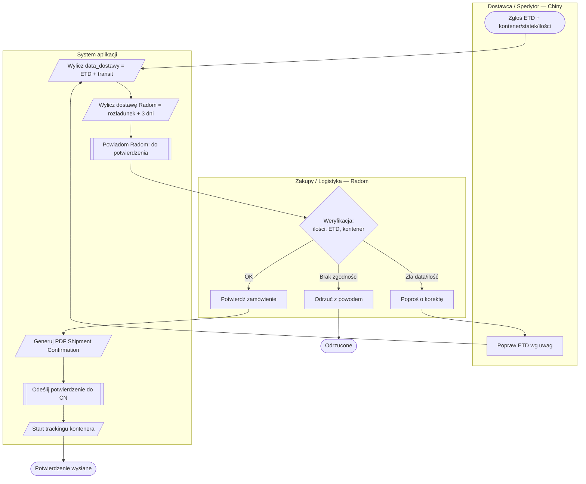
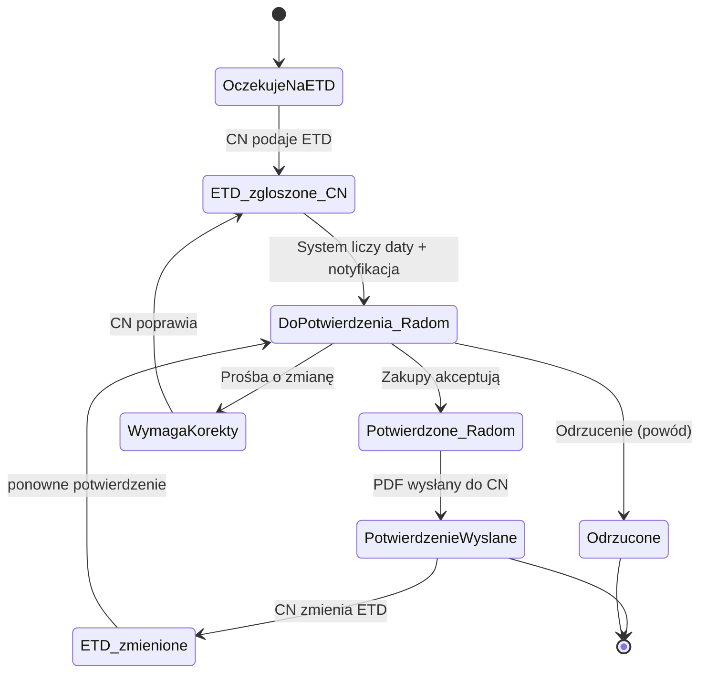

# Proces: Potwierdzenie ETD (Chiny) → Potwierdzenie zamówienia (Radom) → Odesłanie potwierdzenia

> Dokument koncepcyjny procesu (wycinek „purchasing → transport"). Służy jako punkt
> wyjścia do implementacji i do narysowania map w BPMN 2.0 / Figmie.
>
> Diagramy są w **Mermaid** (renderują się na GitHub i na https://mermaid.live).
> Sekcja „Elementy BPMN" pozwala odtworzyć to 1:1 w Camunda Modeler / draw.io.

---

## 1. Cel i zakres

Ujednolicić i zautomatyzować **handshake potwierdzenia wysyłki** między dostawcą/spedytorem
w Chinach a działem zakupów/logistyki w Radomiu:

1. Strona chińska **zgłasza ETD** (i dane wysyłki: kontener, statek, ilości).
2. Radom **weryfikuje i potwierdza** (lub prosi o korektę / odrzuca).
3. System **odsyła formalne potwierdzenie** (PDF) do strony chińskiej i uruchamia śledzenie.

Poza zakresem (osobne procesy): odprawa celna, rozliczenie frachtu, przyjęcie na magazyn.

---

## 2. Aktorzy (swimlane'y)

| Aktor | Rola w procesie |
|---|---|
| **Dostawca / Spedytor (Chiny)** | Podaje i aktualizuje ETD oraz dane wysyłki |
| **Zakupy / Logistyka (Radom)** | Weryfikuje zgodność z PO, potwierdza / koryguje / odrzuca |
| **System (aplikacja)** | Liczy daty, powiadamia, generuje i wysyła potwierdzenie, prowadzi audyt |
| **Akceptujący / Kierownik** *(opcjonalnie)* | Zgoda, gdy wartość/odchylenie przekracza próg |

---

## 3. Mapa procesu (flowchart ze swimlane'ami)



---

## 4. Diagram sekwencji (handshake)

```mermaid
sequenceDiagram
    actor CN as Dostawca/Spedytor (CN)
    participant SYS as System
    actor ZAB as Zakupy (Radom)

    Note over SYS: PO istnieje, planowany ETD
    CN->>SYS: Zgłasza ETD + kontener/statek/ilości
    SYS->>SYS: data_dostawy = ETD + transit; Radom = rozładunek + 3 dni
    SYS-->>ZAB: Powiadomienie „Nowy ETD do potwierdzenia"
    ZAB->>SYS: Weryfikuje (ilości, data, kontener)
    alt Akceptacja
        ZAB->>SYS: Potwierdza zamówienie
        SYS->>SYS: Generuje PDF „Shipment Confirmation"
        SYS-->>CN: Odsyła potwierdzenie (e-mail + portal)
        SYS->>SYS: Status = Potwierdzenie wysłane; start trackingu
    else Korekta / Odrzucenie
        ZAB-->>CN: Prośba o korektę / odrzucenie (powód)
        CN->>SYS: Poprawia ETD
        Note over SYS,ZAB: Powrót do weryfikacji
    end
    opt ETD zmienione później
        CN->>SYS: Aktualizacja ETD
        SYS-->>ZAB: „ETD zmienione — potwierdź ponownie"
    end
```

---

## 5. Maszyna stanów zamówienia (ten wycinek)



---

## 6. Kroki procesu (szczegółowo)

| # | Aktor | Akcja | Stan po akcji | Powiadomienie |
|---|---|---|---|---|
| 1 | System | PO + planowany ETD utworzone | `OczekujeNaETD` | — |
| 2 | CN | Wpisuje ETD, kontener, statek, port, ilości | `ETD_zgloszone_CN` | → Radom |
| 3 | System | Liczy `data_dostawy` i datę dostawy do Radomia | `DoPotwierdzenia_Radom` | → Radom |
| 4 | Radom | Weryfikuje zgodność z PO | (bez zmiany) | — |
| 5a | Radom | **Potwierdza** | `Potwierdzone_Radom` | → CN (wkrótce PDF) |
| 5b | Radom | **Prosi o korektę** (powód) | `WymagaKorekty` | → CN |
| 5c | Radom | **Odrzuca** (powód) | `Odrzucone` | → CN |
| 6 | System | Generuje „Shipment Confirmation" (PDF) | `Potwierdzone_Radom` | — |
| 7 | System | Odsyła PDF do CN (e-mail + portal), start trackingu | `PotwierdzenieWyslane` | → CN |
| 8 | CN | (opcjonalnie) Zmienia ETD | `ETD_zmienione` → krok 4 | → Radom |

---

## 7. Bramki decyzyjne (reguły)

- **Zgodność ilości**: ilości z ETD = ilości z PO (tolerancja konfigurowalna, np. ±0).
- **Sensowność ETD**: ETD ≥ dziś; `ETD + transit` mieści się w oczekiwaniach.
- **Próg akceptacji kierownika** *(opcjonalnie)*: odchylenie ETD > X dni od planu lub wartość > próg → dodatkowy krok zgody.
- **SLA na potwierdzenie (Radom)**: np. 24 h od zgłoszenia → przypomnienie; 48 h → eskalacja.

---

## 8. Model danych (szkic — do dbdiagram.io)

```
Table order {
  id            int [pk]
  po_number     varchar
  supplier_id   int
  planned_etd   date
  transit_days  int
  status        varchar   // maszyna stanów z sekcji 5
}

Table etd_confirmation {
  id            int [pk]
  order_id      int [ref: > order.id]
  etd           date
  vessel        varchar
  container_no  varchar
  pol           varchar    // port załadunku
  qty_json      json       // pozycje + ilości
  submitted_by  varchar    // CN: kontakt/spedytor
  submitted_at  datetime
}

Table order_confirmation {
  id            int [pk]
  order_id      int [ref: > order.id]
  decision      varchar    // accept | correct | reject
  reason        text       // przy correct/reject
  confirmed_by  int        // user Radom
  confirmed_at  datetime
  pdf_path      varchar
  sent_at       datetime
}

Table status_log {
  id        int [pk]
  order_id  int [ref: > order.id]
  field     varchar
  old_value varchar
  new_value varchar
  changed_by varchar
  source    varchar       // cn_portal | radom | system
  at        datetime
}
```

---

## 9. Zawartość dokumentu „Shipment Confirmation" (odsyłany do CN)

- Nr PO + nr zamówienia, dostawca, data wystawienia,
- **Potwierdzony ETD** + przewidywana ETA portu docelowego,
- Numer kontenera / statek / port załadunku,
- Pozycje + ilości (zgodne z PO),
- **Wyliczona data dostawy do magazynu w Radomiu** (rozładunek + 3 dni),
- Status „Potwierdzone przez ACME" + osoba potwierdzająca,
- Uwagi / warunki.

---

## 10. Makiety ekranów (low-fi)

### 10.1 Portal CN — „Podaj / potwierdź ETD"
```
┌─────────────────────────────────────────────────────────┐
│  ACME — Shipment Confirmation Portal        [PL] [EN]   │
├─────────────────────────────────────────────────────────┤
│  PO: 4500000934    Supplier: ALPHAMED                      │
│  Planned ETD: 2026-05-01                                 │
│                                                         │
│  Actual ETD *      [ 2026-05-03      ]                   │
│  Container No. *   [ OOCU8878499     ]                   │
│  Vessel            [ COSCO ...       ]                   │
│  POL (load port)   [ Shanghai        ]                   │
│                                                         │
│  Items / Qty                                            │
│   ┌───────────────┬───────┐                              │
│   │ REF           │ Qty   │                              │
│   │ NL753-S-40    │ 1200  │                              │
│   └───────────────┴───────┘                              │
│                                                         │
│              [ Submit ETD ]   status: ⏳ awaiting        │
└─────────────────────────────────────────────────────────┘
```

### 10.2 Radom — kolejka „Do potwierdzenia"
```
┌──────────────────────────────────────────────────────────────────┐
│  Potwierdzenia ETD                          [Do potwierdzenia ▼]  │
├────────────┬───────────┬──────────┬───────────┬──────────────────┤
│ PO         │ Dostawca  │ ETD (CN) │ Dostawa   │ Akcje            │
│            │           │          │ Radom    │                  │
├────────────┼───────────┼──────────┼───────────┼──────────────────┤
│ 4500000934 │ ALPHAMED    │ 2026-05-03│ 2026-07-11│ ✅ Potwierdź     │
│            │ OOCU8878499│ (za 2 dni)│ (+3 dni)  │ ✏️ Korekta ❌    │
└────────────┴───────────┴──────────┴───────────┴──────────────────┘
```

### 10.3 Podgląd wysłanego potwierdzenia
```
┌─────────────────────────────────────────────────────────┐
│  ✅ Potwierdzenie wysłane — PO 4500000934                │
│  Wysłano: 2026-05-03 14:22  do: supplier@alphamed.cn       │
│                                                         │
│  ETD: 2026-05-03 · Kontener: OOCU8878499 · COSCO         │
│  ETA portu: 2026-07-08 · Dostawa Radom: 2026-07-11      │
│                                                         │
│  [ Pobierz PDF ]   [ Wyślij ponownie ]   [ Otwórz mapę ] │
└─────────────────────────────────────────────────────────┘
```

---

## 11. Przypadki brzegowe i zasady

- **Zmiana ETD po wysłaniu potwierdzenia** → status `ETD_zmienione`, ponowny obieg + nowy PDF (z adnotacją „REV.2").
- **Każda zmiana = wpis w `status_log`** (kto, kiedy, skąd) + powiadomienie drugiej strony.
- **Idempotencja wysyłki** — ponowne „Wyślij" nie tworzy duplikatu, tylko ponawia ten sam PDF (chyba że była rewizja).
- **SLA** na potwierdzenie po stronie Radomia → przypomnienie i eskalacja.
- **Brak odpowiedzi CN** na prośbę o korektę → przypomnienie po N dniach.

---

## 12. Elementy BPMN 2.0 (do narysowania w Camunda Modeler / draw.io)

**Pule / tory:** `Dostawca (CN)`, `Zakupy (Radom)`, `System`.

- **Start Event** (CN): „Wysyłka gotowa do zgłoszenia ETD".
- **User Task** (CN): „Zgłoś ETD i dane wysyłki".
- **Service Task** (System): „Wylicz daty (dostawa, Radom +3 dni)".
- **Send Task** (System): „Powiadom Radom".
- **User Task** (Radom): „Zweryfikuj i zdecyduj".
- **Exclusive Gateway** (Radom): `Potwierdź` / `Korekta` / `Odrzuć`.
- **Service Task** (System): „Generuj PDF Shipment Confirmation".
- **Send Task** (System): „Odeślij potwierdzenie do CN".
- **Service Task** (System): „Uruchom tracking kontenera".
- **End Event** (System): „Potwierdzenie wysłane".
- **End Event** (Radom): „Odrzucone".
- **Boundary / Intermediate Event** (CN): „ETD zmienione" → powrót do weryfikacji.
- **Loop**: `Korekta` → User Task (CN) „Popraw ETD" → ponowna wycena dat.

> Wskazówka: w Camunda Modeler odwzoruj sekcję 3 jako pule+tory, a bramki z sekcji 7 jako
> Exclusive Gateway z warunkami. Sekcja 5 (maszyna stanów) = pole `status` w tabeli `order`.
